

<a href="https://github.com/SinghAbhinav04">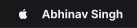</a><a href="https://github.com/SinghAbhinav04?tab=repositories">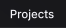</a><a href="https://github.com/SinghAbhinav04/SinghAbhinav04/blob/main/resume.pdf">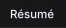</a><a href="https://github.com/SinghAbhinav04/Certificates">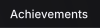</a><a href="https://singhabhinav04.github.io/SinghAbhinav04">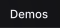</a><a href="mailto:heysinghabhinav@gmail.com">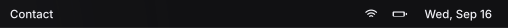</a>
<a href="https://github.com/SinghAbhinav04"></a>
<a href="https://github.com/SinghAbhinav04/SinghAbhinav04">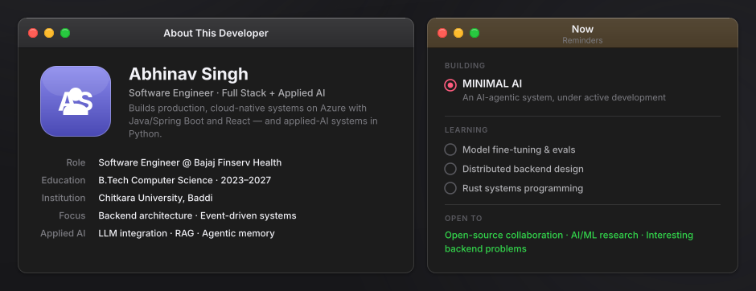</a>
<a href="https://www.linkedin.com/in/singhabhinav04/">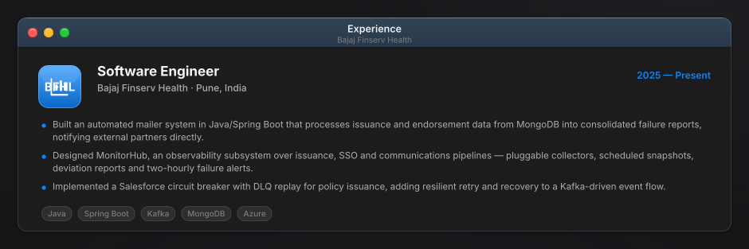</a>
<a href="https://github.com/SinghAbhinav04?tab=repositories">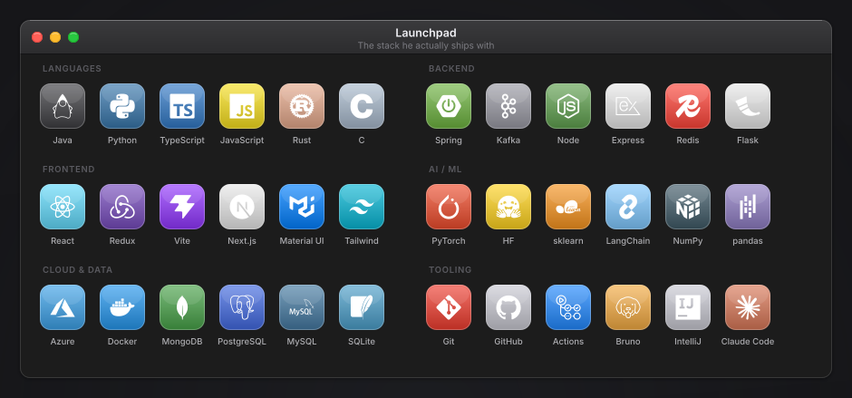</a>
<a href="https://github.com/SinghAbhinav04?tab=repositories">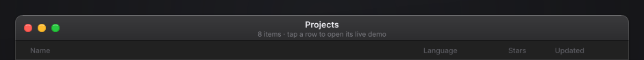</a>
<a href="https://singhabhinav04.github.io/SinghAbhinav04/omni-memory.html">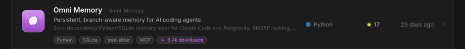</a>
<a href="https://singhabhinav04.github.io/SinghAbhinav04/mixture-of-recursions.html">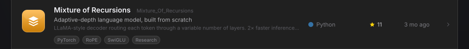</a>
<a href="https://singhabhinav04.github.io/SinghAbhinav04/shanks.html">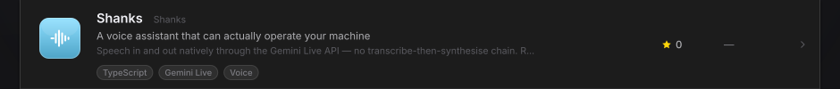</a>
<a href="https://singhabhinav04.github.io/SinghAbhinav04/vault.html">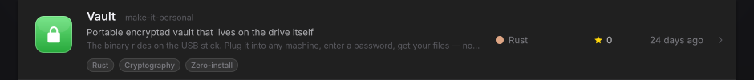</a>
<a href="https://github.com/SinghAbhinav04?tab=repositories">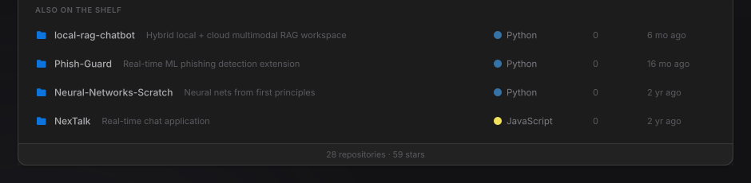</a>
<a href="https://github.com/SinghAbhinav04/SinghAbhinav04/blob/main/resume.pdf">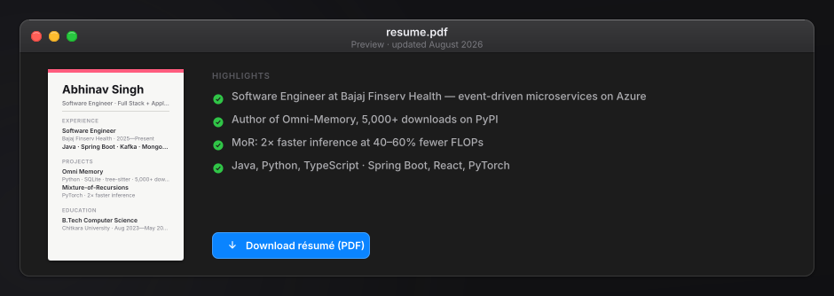</a>
<a href="https://github.com/SinghAbhinav04">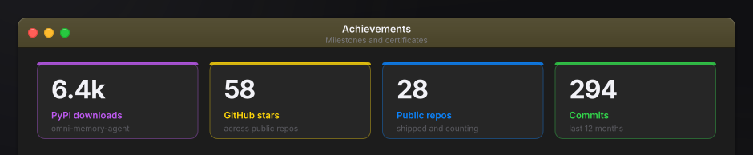</a>
<a href="https://github.com/SinghAbhinav04/Certificates">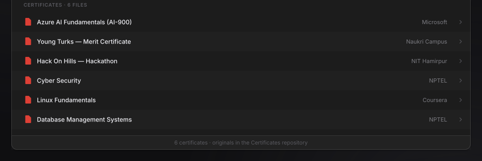</a>
<a href="https://github.com/SinghAbhinav04">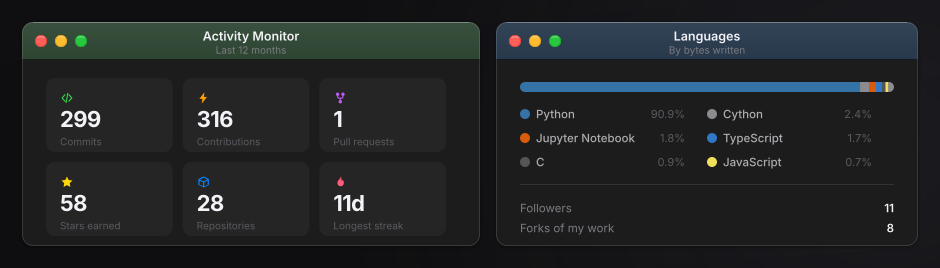</a>
<a href="https://github.com/SinghAbhinav04">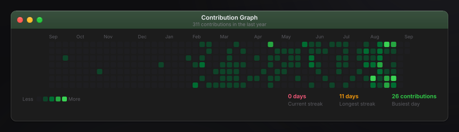</a>
<a href="mailto:heysinghabhinav@gmail.com">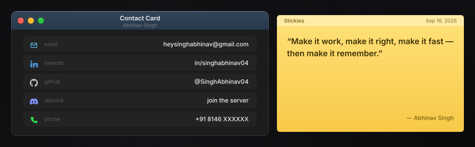</a>
<a href="https://github.com/SinghAbhinav04?tab=repositories">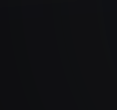</a><a href="https://github.com/SinghAbhinav04/SinghAbhinav04/blob/main/resume.pdf">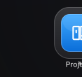</a><a href="https://github.com/SinghAbhinav04/Certificates">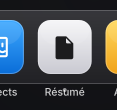</a><a href="https://github.com/SinghAbhinav04">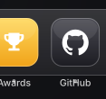</a><a href="https://www.linkedin.com/in/singhabhinav04/">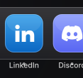</a><a href="https://discord.gg/ygYnFbre">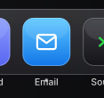</a><a href="mailto:heysinghabhinav@gmail.com">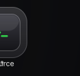</a>

<!--
  This README is generated — do not edit it by hand.

  Edit scripts/config.mjs, then run:  npm run build

  The whole profile is one macOS desktop sliced into SVG images. Every slice is
  wrapped in a link, so clicking a window, a project row, a menu title or a Dock
  icon opens the matching page. Project rows open their interactive demo under
  docs/. .github/workflows/readme.yml refreshes the live numbers — stars,
  commits, PyPI downloads, contribution graph — every day.
-->
